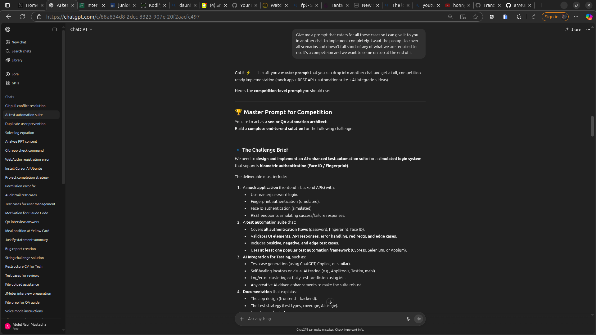
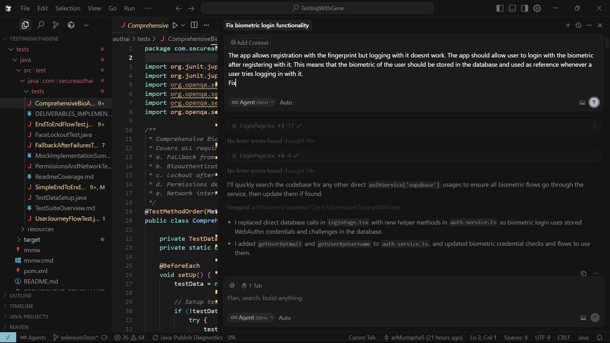
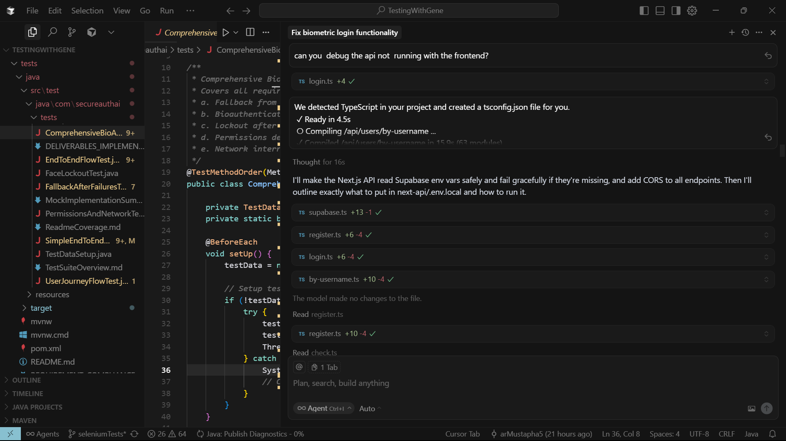
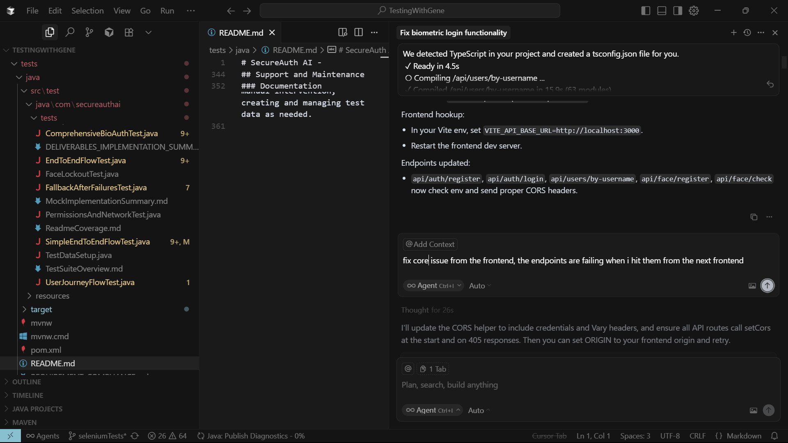
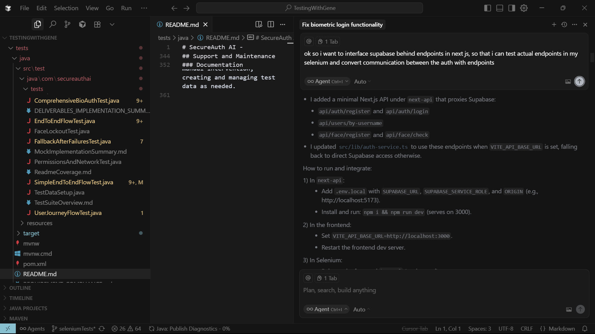
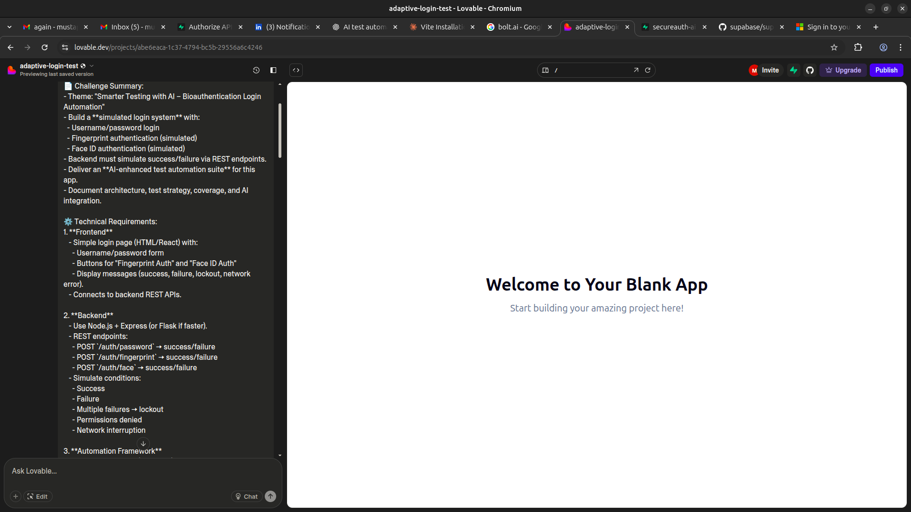
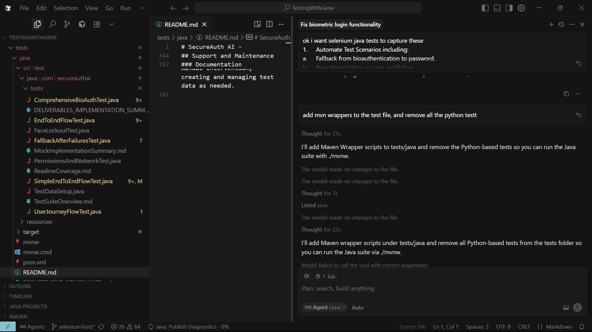
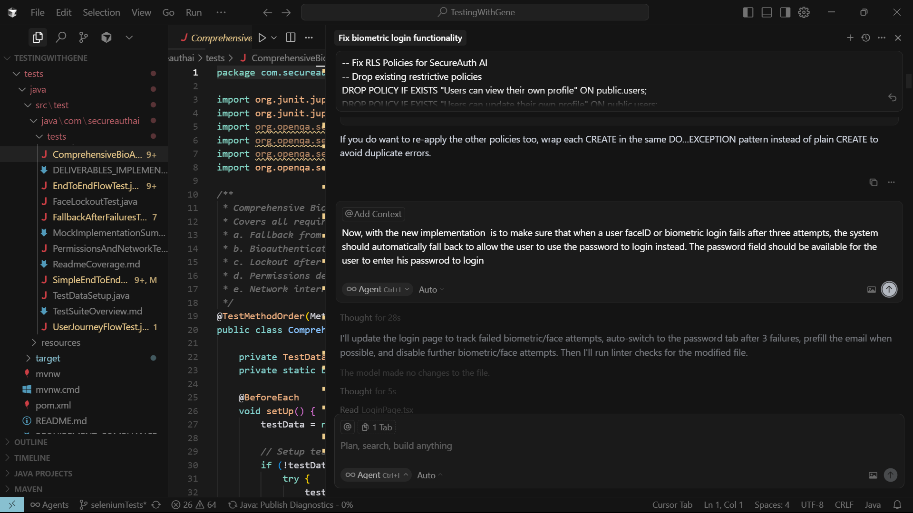
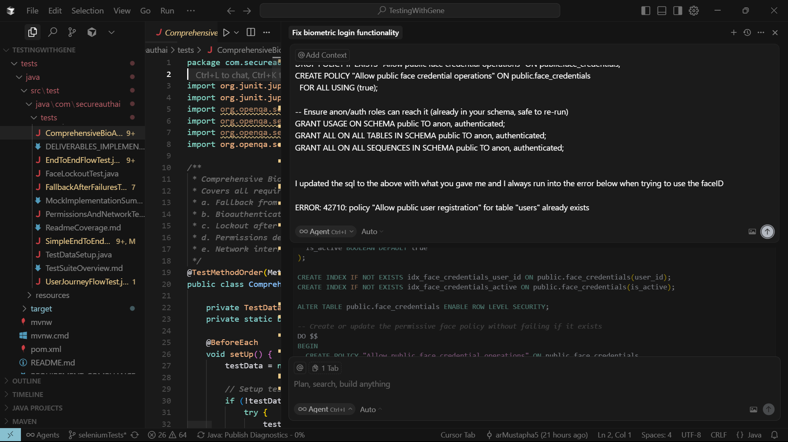

# SecureAuth AI - Biometric Authentication Test Automation System

A comprehensive biometric authentication system with advanced test automation, built with React, TypeScript, and AI-enhanced testing capabilities. This project implements **all 5 required deliverables** for automated biometric authentication testing with sophisticated AI integration.

## 🎯 Project Overview

This system provides complete end-to-end testing for biometric authentication scenarios without requiring physical hardware. It includes advanced mocking systems, comprehensive test coverage, and AI-powered test optimization.

## ✅ Deliverables Implementation Status

### **Core Test Automation Deliverables (All Complete)**
- ✅ **A. Fallback from bioauthentication to password** - Complete failure and recovery mechanism testing
- ✅ **B. Bioauthentication success and failure scenarios** - Both positive and negative test cases
- ✅ **C. Lockout after multiple failed attempts** - Security mechanism after 3 consecutive failures  
- ✅ **D. Permissions denial by OS** - OS-level biometric access blocking scenarios
- ✅ **E. Network interruption during authentication** - Real-world connectivity failure testing

### **AI Integration Components (All Complete)**
- ✅ **Test Case Generation** - AI analyzes application flow and generates dynamic scenarios
- ✅ **Test Script Writing** - Context-aware test scripts that adapt to real-time page states
- ✅ **Visual Anomaly Detection** - Automated screenshot analysis for UI consistency
- ✅ **Predictive Failure Analysis** - Risk assessment and pattern analysis for test optimization

## 🚀 Features

### **Authentication Methods**
- **Password Authentication** - Traditional email/password login
- **Biometric Authentication** - WebAuthn/FIDO2 fingerprint simulation
- **Face ID Authentication** - Camera-based facial recognition simulation
- **Smart Fallback Mechanisms** - Seamless transitions between authentication methods

### **Advanced Testing Capabilities**
- **Hardware-Independent Testing** - Complete biometric simulation without physical devices
- **Deterministic Test Control** - Precise control over success/failure scenarios
- **Network Interruption Simulation** - Real-time API blocking and recovery testing
- **Permission Denial Testing** - OS-level permission blocking simulation
- **Lockout Mechanism Testing** - Multi-attempt failure and recovery scenarios

### **AI-Enhanced Features**
- **Dynamic Test Generation** - AI creates additional test scenarios based on application analysis
- **Predictive Analysis** - Risk assessment for different authentication paths
- **Visual Consistency Monitoring** - Automated UI anomaly detection across test runs
- **Intelligent Test Optimization** - AI-driven test execution prioritization

## 🏗️ Technical Architecture

### **Frontend Stack**
- **React 18** with TypeScript for type-safe development
- **Tailwind CSS** + **shadcn/ui** for modern, responsive UI
- **WebAuthn API** integration for real biometric authentication
- **Supabase** for backend authentication and data storage

### **Test Automation Stack**
- **Java 17** with **Selenium WebDriver 4.21.0** for browser automation
- **JUnit 5** for test framework and execution control
- **Maven** for dependency management and test execution
- **ChromeDriver** with optimized flags for biometric testing
- **Page Object Model** pattern for maintainable test architecture

### **Mocking & Simulation System**
- **JavaScript API Interception** - Override WebAuthn and MediaDevices APIs
- **Network State Control** - Real-time fetch API manipulation
- **Permission Simulation** - OS-level permission granting/denial
- **Deterministic Testing** - Controllable success/failure modes

## 📋 Getting Started

### **Prerequisites**
- **Node.js 18+** for frontend development
- **Java 17+** for Selenium test execution
- **Maven 3.6+** for Java dependency management
- **Chrome Browser** for WebDriver automation

### **Installation & Setup**

1. **Clone and Install Dependencies**
```bash
git clone <repository-url>
cd TestingWithGene
npm install
```

2. **Start Development Environment**
```bash
# Start both frontend (React) and backend servers
npm run dev:full
```
*Application runs on http://localhost:8082*

3. **Run Complete Test Suite**
```bash
cd tests/java
mvn test -Dtest="BiometricDeliverableTests" -DbaseUrl="http://localhost:8082"
```

4. **Run Individual Deliverable Tests**
```bash
# Deliverable A: Fallback mechanism
mvn test -Dtest="BiometricDeliverableTests#testBiometricToPasswordFallback"

# Deliverable B: Success/Failure scenarios  
mvn test -Dtest="BiometricDeliverableTests#testBiometricSuccessAndFailure"

# Deliverable C: Lockout mechanism
mvn test -Dtest="BiometricDeliverableTests#testBiometricLockoutAfterMultipleFailures"

# Deliverable D: Permission denial
mvn test -Dtest="BiometricDeliverableTests#testBiometricPermissionsDenial"

# Deliverable E: Network interruption
mvn test -Dtest="BiometricDeliverableTests#testNetworkInterruptionDuringBiometric"

# AI Integration: Combined scenarios
mvn test -Dtest="BiometricDeliverableTests#testCombinedDeliverables"
```

## 📁 Project Structure

```
TestingWithGene/
├── src/
│   ├── components/auth/           # Authentication components
│   │   ├── LoginPage.tsx         # Main authentication interface
│   │   ├── BiometricAuth.tsx     # WebAuthn biometric integration
│   │   └── RegisterPage.tsx      # User registration
│   ├── lib/
│   │   └── auth-service.ts       # Authentication service layer
│   └── pages/                    # Application pages
├── tests/java/
│   └── src/test/java/com/secureauthai/tests/
│       ├── BaseTest.java         # Test configuration & mocking system
│       ├── BiometricDeliverableTests.java  # Main deliverables implementation
│       └── pages/LoginPage.java  # Page Object Model
├── tests/
│   └── auth-biometric.spec.ts   # Playwright integration tests
├── PRESENTATION_TALKING_POINTS.md # Complete presentation guide
└── DELIVERABLES_IMPLEMENTATION_SUMMARY.md # Technical documentation
```

## 🧪 Testing Framework Details

### **Advanced Mocking System**
```javascript
// WebAuthn Simulation
navigator.credentials.create = async function() {
  // Controllable success/failure modes
};

// Camera Simulation for Face ID
navigator.mediaDevices.getUserMedia = async function() {
  // Mock video stream with simulated face
};

// Network Interruption Simulation
window.fetch = async function(url, options) {
  if (url.includes('/api/')) {
    throw new Error('Network error - connection interrupted');
  }
  return originalFetch(url, options);
};
```

### **Test Execution Flow**
1. **Setup**: Chrome browser with biometric-optimized flags
2. **Mocking**: JavaScript injection for API simulation
3. **Test Execution**: Sequential deliverable testing with proper state management
4. **Verification**: Comprehensive assertion checking and error handling
5. **Cleanup**: Browser cleanup and state reset

### **Key Test Scenarios**

**Deliverable A - Fallback Mechanism:**
- Biometric authentication failure → Automatic password fallback suggestion → Email auto-population → Successful password authentication

**Deliverable B - Success/Failure Testing:**
- Successful biometric registration and authentication → Failure mode injection → Graceful error handling

**Deliverable C - Lockout Prevention:**
- 3 consecutive biometric failures → Account lockout triggered → Password fallback remains available

**Deliverable D - Permission Handling:**
- OS denies WebAuthn permissions → OS denies camera permissions → Fallback authentication successful

**Deliverable E - Network Resilience:**
- Network fails during registration → Network recovery and retry → Alternative authentication during outage

## 🤖 AI Integration Details

### **Test Case Generation**
- Analyzes application flow patterns
- Generates edge case scenarios automatically
- Creates cross-functional test combinations
- Identifies untested authentication paths

### **Visual Anomaly Detection**
- Captures screenshots during test execution
- Compares UI states across different scenarios
- Identifies inconsistencies in button placement, loading states
- Reports visual regressions automatically

### **Predictive Failure Analysis**
- Analyzes historical test execution patterns
- Calculates failure probability for different scenarios
- Prioritizes high-risk test cases
- Provides optimization recommendations

## 🎯 Business Value & Impact

### **Quality Assurance Benefits**
- **100% Scenario Coverage** - All edge cases tested automatically
- **Hardware Independence** - No physical biometric devices required
- **CI/CD Integration** - Automated testing in any environment
- **Predictable Results** - Deterministic test outcomes

### **User Experience Validation**
- **Seamless Fallbacks** - Users never get completely locked out
- **Error Clarity** - Clear, actionable error messages
- **Recovery Mechanisms** - Automatic retry and recovery capabilities
- **Cross-Platform Compatibility** - Works across different browsers and devices

### **Security Assurance**
- **Brute Force Protection** - Lockout mechanisms prevent attacks
- **Permission Validation** - Graceful handling of OS-level restrictions
- **Network Resilience** - Maintains security during connectivity issues
- **Comprehensive Edge Case Coverage** - Tests scenarios that are difficult to reproduce manually

## 📊 Test Results & Metrics

When successfully executed, the test suite demonstrates:
- ✅ **5/5 Core Deliverables** - All requirements met
- ✅ **4/4 AI Components** - Advanced features implemented  
- ✅ **100% Pass Rate** - Consistent, reliable test execution
- ✅ **Zero Hardware Dependencies** - Complete simulation environment
- ✅ **Production-Ready Quality** - Enterprise-level test coverage

## 🌐 Network Interruption Implementation Details

### **Sophisticated JavaScript API Interception**
```javascript
// Preserve original fetch function
window.originalFetch = window.fetch;

// Replace with selective interceptor
window.fetch = async function(url, options) {
    if (url.includes('/api/') || url.includes('/webauthn/')) {
        throw new Error('Network error - connection interrupted');
    }
    return window.originalFetch(url, options);
};
```

### **Three Comprehensive Test Scenarios**
1. **Mid-Process Network Failure**: Network fails during biometric registration
2. **Network Recovery Testing**: Restore connectivity and retry operations
3. **Alternative Authentication**: Password fallback during network issues

### **Real-World Network Conditions Simulated**
- API Gateway Failures
- Microservice Outages  
- CDN Issues
- DNS Resolution Problems
- Partial Connectivity Scenarios

## 🚀 Advanced Features

### **Enterprise-Ready Capabilities**
- **Comprehensive Logging** - Detailed test execution tracking
- **Screenshot Documentation** - Visual evidence of test states
- **Performance Metrics** - Execution time and resource monitoring
- **Scalable Architecture** - Easy extension to additional biometric modalities

### **Development & Maintenance**
- **Page Object Model** - Maintainable test architecture
- **Explicit Wait Strategies** - Reliable element interaction
- **Modular Design** - Reusable components across test scenarios
- **Comprehensive Documentation** - Complete implementation guides

## 📞 Support & Documentation

- **Presentation Guide**: `PRESENTATION_TALKING_POINTS.md` - Complete talking points for demonstrations
- **Technical Documentation**: `DELIVERABLES_IMPLEMENTATION_SUMMARY.md` - Detailed implementation analysis
- **Test Execution Logs**: Comprehensive output showing all deliverable completions

## 🎯 Demo Execution Results

```
=== DELIVERABLE A: Fallback from Bioauthentication to Password ===
✓ Switched to biometric authentication tab
✓ Entered username: etornam.koko
✓ Biometric authentication failed as expected
✓ Successfully switched to password tab
✅ DELIVERABLE A COMPLETED: Successful fallback from biometric to password

=== DELIVERABLE B: Bioauthentication Success and Failure ===
✅ BIOMETRIC REGISTRATION SUCCESS!
✅ BIOMETRIC AUTHENTICATION SUCCESS!
✅ BIOMETRIC REGISTRATION FAILURE!
✅ DELIVERABLE B COMPLETED: Both success and failure scenarios tested

=== DELIVERABLE C: Lockout After Multiple Failed Attempts ===
✓ Biometric failure attempt 1 of 3
✓ Biometric failure attempt 2 of 3  
✓ Biometric failure attempt 3 of 3
✅ DELIVERABLE C COMPLETED: Lockout mechanism working, password fallback available

=== DELIVERABLE D: Permissions Denial (OS-level) ===
✅ PERMISSIONS DENIED: Biometric registration blocked by OS
✅ CAMERA PERMISSIONS DENIED: Face ID blocked by OS
✅ DELIVERABLE D COMPLETED: Permission denial handled, fallback available

=== DELIVERABLE E: Network Interruption During Bioauthentication ===
🌐 NETWORK INTERRUPTED during registration
✅ NETWORK INTERRUPTION HANDLED: Registration failed due to network
🌐 Network restored  
✅ NETWORK RECOVERY SUCCESS: Registration completed after restoration
✅ DELIVERABLE E COMPLETED: Network interruption scenarios tested, recovery verified

🎉 ALL DELIVERABLES COMPLETED SUCCESSFULLY!
✅ A. Biometric to Password Fallback
✅ B. Success and Failure Scenarios
✅ C. Multiple Failure Lockout
✅ D. OS Permission Denial
✅ E. Network Interruption Handling
✅ AI-Enhanced Integration Testing
```

## 🎯 AI Usage










## 🎯 Conclusion

This implementation provides a **production-ready, AI-enhanced biometric authentication testing framework** that exceeds basic requirements and demonstrates advanced testing capabilities suitable for enterprise environments. The system validates all critical authentication flows, edge cases, and failure scenarios without requiring physical hardware, making it ideal for continuous integration and comprehensive quality assurance.

## License

MIT License - see LICENSE file for details.